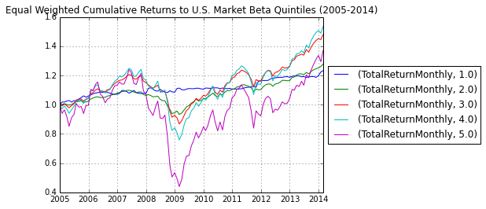

.. code:: python

    # Python libraries needed for statistics and plotting
    import pandas
    import numpy as np
    import matplotlib.pyplot as plt
    from IPython.display import HTML
    %matplotlib inline
.. code:: python

    def clean_delistings(monthly_raw_returns,
                         date_column="Date_"):
        """
        Remove records from months when they are not as-of the final available
        date in the month. Replace with NaN and move the date to the actual end
        of month date.
        """
        original_columns = monthly_raw_returns.columns.values.tolist()
        original_columns.remove(date_column)
    
        # First get all of the max-dates which determine the month-end dates.
        for period in ("year", "month", "day"):
            monthly_raw_returns[period] = monthly_raw_returns.Date_.map(
                lambda x: getattr(x, period)
            )
            
        monthly_raw_returns["yearmonth"] = (
            100*monthly_raw_returns["year"] + monthly_raw_returns["month"]
        )
    
        max_day = monthly_raw_returns.groupby("yearmonth").agg({"day":"max"})
        max_day = max_day.rename(columns={"day":"max_day"})
        monthly_raw_returns = pandas.merge(
            monthly_raw_returns, 
            max_day, 
            left_on="yearmonth", 
            right_index=True, 
            how="left"
        )
    
        at_max = monthly_raw_returns["day"] == monthly_raw_returns["max_day"]
        monthly_raw_returns.ix[~at_max, "TotRet"] = np.NaN
    
        monthly_raw_returns["AdjDate"] = monthly_raw_returns.apply(
            lambda row: row[date_column].replace(day=row["max_day"]),
            axis=1
        )
        
        return monthly_raw_returns[["AdjDate"] + original_columns]

.. code:: python

    def adjust_period_returns(monthly_raw_returns,
                              date_column="AdjDate",
                              identifier_column="Code",
                              returns_column="TotRet"):
        """
        Given a series of raw returns (gross from inception) that fall on
        month-ends, apply a transformation to turn them into period-by-period
        returns.
        """
        def helper(id_specific_dataframe):
            df = id_specific_dataframe.sort(date_column, ascending=False)
            df[returns_column] = (1.0/100.0) * df[returns_column]
    
            df["TotalReturnMonthly"] = (
                df[returns_column].diff(-1) /        # r_new - r_old
                (1.0 + df[returns_column].shift(-1)) # 1 + r_old
            )
    
            return df[[date_column, "TotalReturnMonthly"]]
    
        adj_returns = monthly_raw_returns.groupby(identifier_column).apply(helper)
        adj_returns = (
            adj_returns
            .reset_index()
            .drop("level_1", axis=1)
        )
    
        monthly_raw_returns = pandas.merge(
            monthly_raw_returns, 
            adj_returns, 
            left_on=[identifier_column, date_column],
            right_on=[identifier_column, date_column],
            how="left"
        )
    
        return monthly_raw_returns

.. code:: python

    def merge_fama_french_from_hdf(idc_dataframe,
                                   idc_date-column="AdjDate",
                                   ff_date_column="Date"):
        """
        Loads the included FF data set. Merges with adjusted dates already in the 
        csv.
        """
        ff_df = pandas.read_hdf(
            "/home/ely/.estuarial/.cache/ff_aligned_with_idc.hdf5"
        )
    
        ff_df[ff_date_column] = ff_df[ff_date_column].map(lambda x: x.date())
    
        return pandas.merge(
            idc_dataframe, 
            ff_df, 
            left_on=idc_date_column,
            right_on=ff_date_column,
            how="left"
        )
.. code:: python

    def pandas_rolling_ols(single_id_dataframe,
                           date_column="AdjDate"):
        """
        Perform rolling ols and return the columns of date-based coefficients,
        t-stats, idiosyncratic vol, etc.
        """
    
        
        df = (
            single_id_dataframe
            .sort(date_column, ascending=True)
            .set_index(date_column)
        )
        
        
        try:
            ols_result = pandas.ols(
                y=df["TotalReturnMonthly"] - df["RiskFreeRate"], 
                x=df["ExcessMarket"], 
                window=60, 
                min_periods=12, 
                intercept=True
            )
    
            beta = ols_result.beta['x']
            beta.name = "Beta"
            beta_tstat = ols_result.t_stat['x']
            beta_tstat.name = "Beta_tstat"
            df = df.join(beta).join(beta_tstat)
    
        except:
            df["Beta"] = np.NaN
            df["Beta_tstat"] = np.NaN
            
        return df
.. code:: python

    #####
    # Example usage of the estuarial tool to handle a complicated ad-hoc query:
    #####
    from estuarial.query.raw_query import RAW_QUERY
    
    # Since this is computationally expensive, default to skip it within this cell.
    if False:
        rq = RAW_QUERY()
        
        # Raw SQL query retrieving the final pricing record per month across all U.S.
        # securities in the IDC prc.PrcDly table.
        monthly_query = """ 
        with MonthlyView as (
            SELECT ROW_NUMBER() OVER(  
                PARTITION BY Code, 100*YEAR(Date_) + MONTH(Date_)
                ORDER BY Date_ desc 
            ) as RowNumber   
            , Code 
            , Date_
            , TotRet 
            FROM prc.PrcDly
            WHERE Date_ BETWEEN '2004-01-01' AND '2014-12-31'
        )
        SELECT * 
        FROM MonthlyView 
        WHERE RowNumber = 1
        """
        
        # Execute the query.
        # Takes a long time if not executed from the Wakari instance.
        raw_idc_data = rq.raw_query(monthly_query)
    
        # Alternatively, load from cached copy of the raw query result.
        raw_idc_data = pandas.read_hdf(
            "/home/ely/.estuarial/.cache/cache_raw_idc_monthly_totret.hdf5", 
            "idc_monthly_totret"
        )
    
        # Clean delisted securities and compute monthly period returns from the IDC since-
        # inception TotRet gross returns.
        # Takes around 100 seconds.
        monthly_returns = adjust_period_returns(clean_delistings(raw_idc_data))
        monthly_returns["AdjDate"] = monthly_returns.AdjDate.map(lambda x: x.date())
        
        # Load and merge Fama French market returns.
        monthly_returns = merge_fama_french_from_hdf(monthly_returns)
    
        # Get a new data set with a reduced set of the columns.
        idc_monthly_with_ff = monthly_returns[
            ['AdjDate', 
             'Code', 
             'TotRet', 
             'TotalReturnMonthly', 
             'ExcessMarket', 
             'RiskFreeRate']
        ]
    
        # Adjust the percentages from Fama/French to be decimal values.
        idc_monthly_with_ff["ExcessMarket"] = (1.0/100) * idc_monthly_with_ff.ExcessMarket
        idc_monthly_with_ff["RiskFreeRate"] = (1.0/100) * idc_monthly_with_ff.RiskFreeRate
    
        # Group by each security and apply a transformation to store rolling beta and beta t-stat
        # values from the regression on the market return.
        idc_with_betas = (
            idc_monthly_with_ff
            .groupby('Code')
            .apply(pandas_rolling_ols)
            .reset_index(level=0, drop=True)
            .reset_index()
        )

.. code:: python

    # Directly load beta data set (`idc_with_betas` from the cell above.)
    idc_with_betas = pandas.read_hdf(
        "/home/ely/.estuarial/.cache/cache_idc_with_betas.hdf5", 
        "idc_returns_and_betas"
    )
    
    # Only use data set for Feb 2014 and earlier (to align with Fama/French date coverage).
    idc_with_betas = idc_with_betas[idc_with_betas.AdjDate < datetime.date(2014, 3, 1)]
    
    # Get equal-count based percentiles for betas within each month.
    #idc_with_betas["Beta_rank"] = pandas.concat(
    #    idc_with_betas.groupby("AdjDate").apply(
    #        lambda x: x.Beta.rank()/(1.0 * x.Beta.notnull().sum())
    #    ).values.tolist()
    #)
    
    idc_with_betas["Beta_rank"] = idc_with_betas.groupby("AdjDate").apply(
            lambda x: x.Beta.rank()/(1.0 * x.Beta.notnull().sum())
    )
    
    
    # Define a helper function for turning a within-month rank into a within-month quintile.
    def quintile_marker(rank):
        if rank <= 0.20:
            return 1
        elif 0.20 < rank <= 0.40:
            return 2
        elif 0.40 < rank <= 0.60:
            return 3
        elif 0.60 < rank <= 0.80:
            return 4
        elif 0.80 < rank:
            return 5
        
    # Place a column containing the quintile markings.
    idc_with_betas["Beta_quintile"] = idc_with_betas.Beta_rank.map(quintile_marker)

.. code:: python

    # Calculate the within-month equal-weighted average of returns across each Beta quintile group.
    # If market cap were joined to the data, then cap-weighted returns could follow a similar calculation.
    equal_weighted_returns_to_beta_quintiles = idc_with_betas.groupby(["AdjDate", "Beta_quintile"]).agg(
        {"TotalReturnMonthly":np.mean}
    )

.. code:: python

    # Handle the beta returns for plotting.
    temp = equal_weighted_returns_to_beta_quintiles.unstack(level=1)
    
    # Make an entry for 2005-1-1, with return of 1.0, so that it functions as
    # cumulative return of 1.0 -- the nominal investing start date.
    temp0 = pandas.DataFrame().reindex_like(temp.head(1))
    temp0 = temp0.set_index(temp0.index.map(lambda x: x.replace(day=1)))
    temp0.ix[0, :] = 0.0
    temp = pandas.concat([temp0, temp], axis=0)
    
    # Calculate cumulative returns.
    cumulative_returns = temp.apply(lambda x: (1.0 + x).cumprod())
    
    # Plot the result.
    fig, ax = plt.subplots()
    cumulative_returns.plot(ax=ax, legend=False)
    ax.legend(loc='center left', bbox_to_anchor=(1, 0.5))
    ax.set_title("Equal Weighted Cumulative Returns to U.S. Market Beta Quintiles (2005-2014)")

.. parsed-literal::

    <matplotlib.text.Text at 0x6082750>

