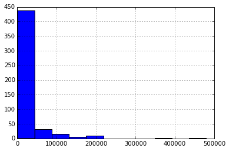
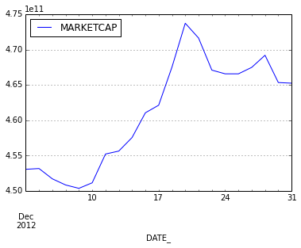

.. code:: python

    # Some basic imports for numerics, plotting, and displaying tables.
    import pandas
    import numpy as np
    import matplotlib.pyplot as plt
    from IPython.display import HTML
    %matplotlib inline
.. code:: python

    # Import the part of estuarial that provides a look at index constituents.
    from estuarial.browse.market_index import MarketIndex
.. code:: python

    # Create an instance of the MarketIndex class.
    m = MarketIndex()
    
    # "Slice" the data along the dimensions you'd like.
    # In this case, it's along the S&P 500 index, for the date 2012-12-28.
    dec2012_sp500 = m['S&P 500', '2012-12-28']
.. code:: python

    # Display a table of the first 5 fetched results.
    dec2012_sp500.head()
    

.. raw:: html

    

    <table border="1" class="dataframe">
      <thead>
        <tr style="text-align: right;">
          <th></th>
          <th>INAME</th>
          <th>ITICKER</th>
          <th>TICKER</th>
          <th>CUSIP</th>
          <th>NAME</th>
          <th>DATE_</th>
          <th>CLOSE_</th>
          <th>SHARES</th>
          <th>SECCODE</th>
          <th>RELATIVE_MARKET_CAP</th>
        </tr>
      </thead>
      <tbody>
        <tr>
          <th>0</th>
          <td> S&amp;P 500 INDEX</td>
          <td> SPX_IDX</td>
          <td> ADBE</td>
          <td> 00724F10</td>
          <td>     Adobe Systems Inc</td>
          <td>2012-12-28 00:00:00</td>
          <td> 36.900002</td>
          <td>  495.055</td>
          <td> 2099</td>
          <td> 18267.530255</td>
        </tr>
        <tr>
          <th>1</th>
          <td> S&amp;P 500 INDEX</td>
          <td> SPX_IDX</td>
          <td>  ADI</td>
          <td> 03265410</td>
          <td>    Analog Devices Inc</td>
          <td>2012-12-28 00:00:00</td>
          <td> 41.470001</td>
          <td>  301.359</td>
          <td> 5689</td>
          <td> 12497.358098</td>
        </tr>
        <tr>
          <th>2</th>
          <td> S&amp;P 500 INDEX</td>
          <td> SPX_IDX</td>
          <td>  AGN</td>
          <td> 01849010</td>
          <td>          Allergan Inc</td>
          <td>2012-12-28 00:00:00</td>
          <td> 90.129997</td>
          <td>  307.535</td>
          <td> 3122</td>
          <td> 27718.128705</td>
        </tr>
        <tr>
          <th>3</th>
          <td> S&amp;P 500 INDEX</td>
          <td> SPX_IDX</td>
          <td> ALTR</td>
          <td> 02144110</td>
          <td>           Altera Corp</td>
          <td>2012-12-28 00:00:00</td>
          <td> 34.009998</td>
          <td>  320.573</td>
          <td> 3788</td>
          <td> 10902.687192</td>
        </tr>
        <tr>
          <th>4</th>
          <td> S&amp;P 500 INDEX</td>
          <td> SPX_IDX</td>
          <td> AMAT</td>
          <td> 03822210</td>
          <td> Applied Materials Inc</td>
          <td>2012-12-28 00:00:00</td>
          <td> 11.260000</td>
          <td> 1197.660</td>
          <td> 6088</td>
          <td> 13485.651874</td>
        </tr>
      </tbody>
    </table>
    

.. code:: python

    # Display a histogram of the stock-level market cap values.
    dec2012_sp500.RELATIVE_MARKET_CAP.hist(bins=11)
    

.. parsed-literal::

    <matplotlib.axes.AxesSubplot at 0x524e510>

.. code:: python

    # Get data for the S&P Belgium BMI index across December 2012
    bmi_belgium = m['S&P Belgium BMI', '2012-12-01':'2012-12-31']
    bmi_belgium.head()

.. raw:: html

    

    <table border="1" class="dataframe">
      <thead>
        <tr style="text-align: right;">
          <th></th>
          <th>DATE_</th>
          <th>ITICKER</th>
          <th>CLOSE_</th>
          <th>AdjClose</th>
          <th>MARKETCAP</th>
          <th>SECCODE</th>
          <th>NAME_</th>
        </tr>
      </thead>
      <tbody>
        <tr>
          <th>0</th>
          <td>2012-12-03 00:00:00</td>
          <td> SPCBMICBEUSD</td>
          <td> 79.96</td>
          <td> 79.96</td>
          <td> 612172000</td>
          <td> 13601</td>
          <td> S&amp;P Belgium BMI (US Dollar)</td>
        </tr>
        <tr>
          <th>1</th>
          <td>2012-12-04 00:00:00</td>
          <td> SPCBMICBEUSD</td>
          <td> 79.55</td>
          <td> 79.55</td>
          <td> 609732000</td>
          <td> 13601</td>
          <td> S&amp;P Belgium BMI (US Dollar)</td>
        </tr>
        <tr>
          <th>2</th>
          <td>2012-12-05 00:00:00</td>
          <td> SPCBMICBEUSD</td>
          <td> 79.75</td>
          <td> 79.75</td>
          <td> 610401000</td>
          <td> 13601</td>
          <td> S&amp;P Belgium BMI (US Dollar)</td>
        </tr>
        <tr>
          <th>3</th>
          <td>2012-12-06 00:00:00</td>
          <td> SPCBMICBEUSD</td>
          <td> 80.15</td>
          <td> 80.15</td>
          <td> 609636000</td>
          <td> 13601</td>
          <td> S&amp;P Belgium BMI (US Dollar)</td>
        </tr>
        <tr>
          <th>4</th>
          <td>2012-12-07 00:00:00</td>
          <td> SPCBMICBEUSD</td>
          <td> 80.50</td>
          <td> 80.50</td>
          <td> 609540000</td>
          <td> 13601</td>
          <td> S&amp;P Belgium BMI (US Dollar)</td>
        </tr>
      </tbody>
    </table>
    

.. code:: python

    # Get a time-series plot of the total index market cap for each day in December 2012.
    bmi_belgium.groupby("DATE_").agg({"MARKETCAP":np.sum}).plot()

.. parsed-literal::

    <matplotlib.axes.AxesSubplot at 0x5ec86d0>

